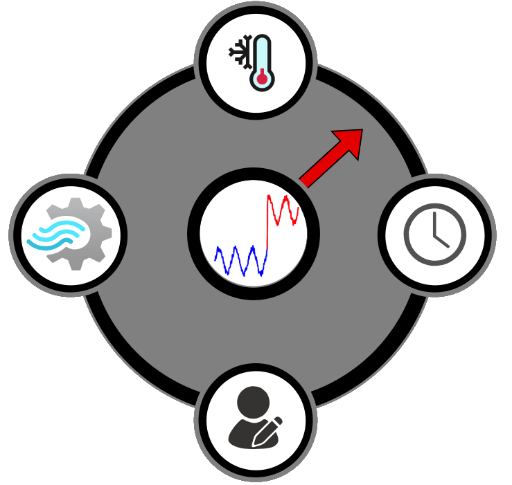
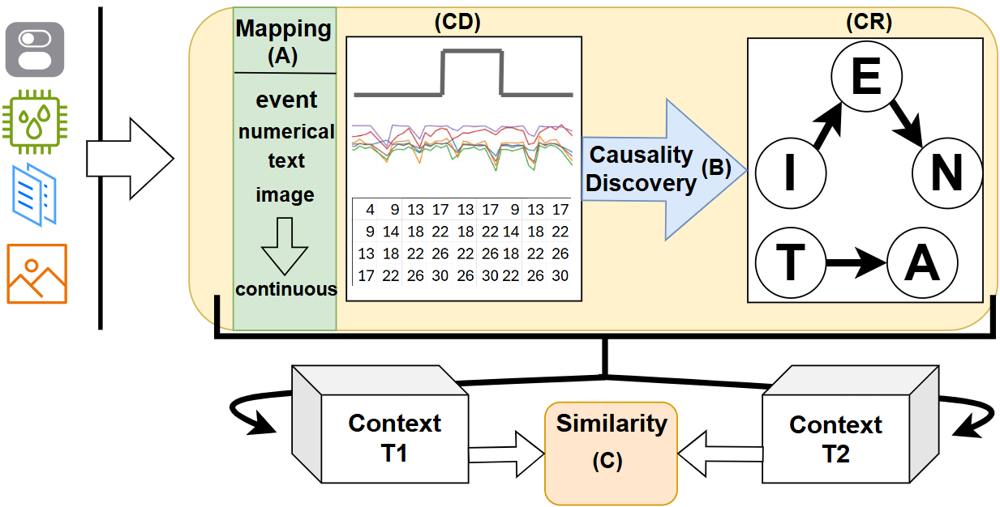
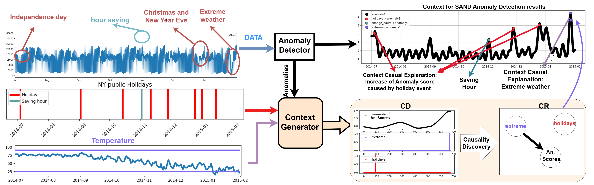
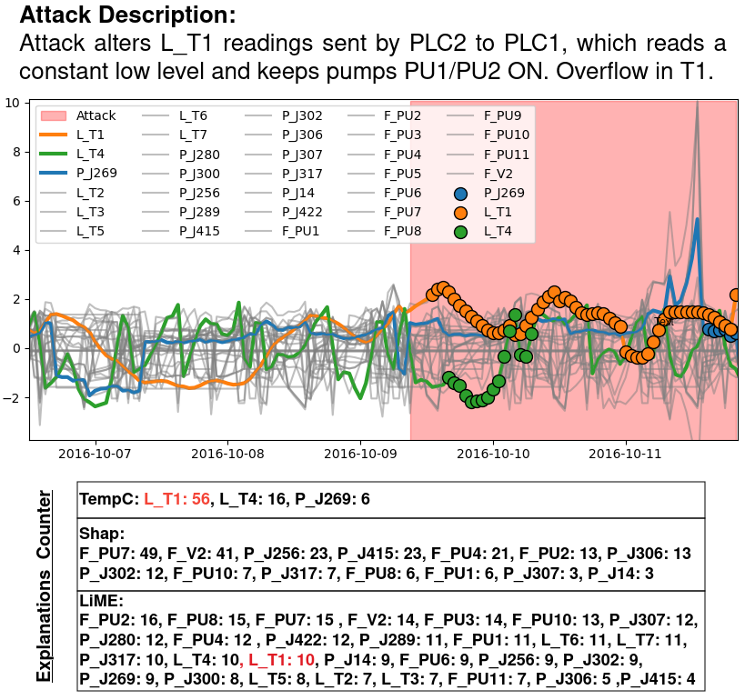
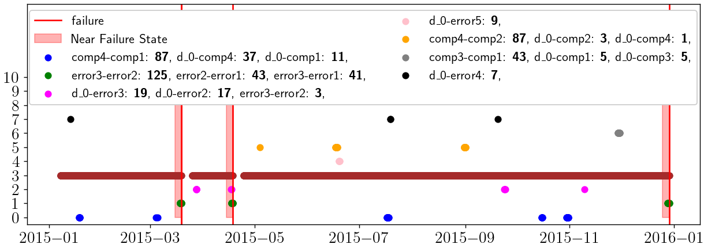

<h1 align="center">Explainable Contextualized Anomaly Detection for Time Series</h1>
<hr>
<p align="center">
  
</p>

Temporal Explainable Context for Anomaly Detection (TECAD) provides a contextual framework for representing the context by integrating 
the AD results with various multimodal data sources. This framework provides
both metadata-based and feature-based causal explanations for interpreting anomalies.
The TempC4AD formulation depends on three key components, as shown in Figure: (A) a mapping mechanism
to convert multimodal data into multivariate time series,
(B) a causality discovery component to identify relationships
among the multivariate time series, and (C) a similarity
mechanism for comparing contexts.




### DATA

Download data from [here](https://drive.google.com/file/d/1MjfRoWWnlUtxzaqcCzpJDuXp3EpaUhEm/view?usp=sharing) and place them under Data/ folder in root directory.

The structure should be like that: \
root/ \
-----Data/ \
----------azurepdm/ \
--------------\*.csv \
----------BATADAL/ \
---------------\*.csv \
----------valve1/ \
---------------\*.csv \


## Examples

### Metadata Explanations of New York taxi demand

Combine multimodal information (holidays events, weather) using TempC4AD to provide explanations for taxi demand.



Reproduce this example by running code [here](nytaxi/NYtaxi.ipynb) 


### Feature Model Explanations

TempC4AD can be used as Model Depended explainable technique to provide feature-based explanations. 
The following figure shows an anomaly period (example from BATADAL), 
along with explainable features generated by TempC4AD, LIME and SHAP.
TempC4AD provide relevant explanations with ground truth without produce many non-relevant explanations.




## Reproduce

Ensure you have Conda installed. You can install Miniconda or Anaconda from [here](https://docs.anaconda.com/miniconda/install/):
```bash
conda --version
```

Create conda environment from `enviorment.yml`:
```bash
conda env create -f environment.yml
```

Activate conda environment:
```bash
conda activate context_pdm
```


### Explanation evaluation:

Under `EvalXAI` there are available methods and pipelines for running LIME, SHAP, 
and proposed Context framework on EXATHLON [1] and BATADAL [2] datasets.

Follow guidelines in the readme files:

- Run explanation evaluation on BATADAL [here](EvalXAI/XAI_BATALAD/README.md)
- Run explanation evaluation on EXATHLON [here](EvalXAI/XAI_EXATHLON/README.md)

### Context Decision-Making:

There are three main files (main_Azure, main_BATADAL and main_SKAB) which correspond
to the three case-studies presented. All three implement experiments for running online anomaly detection (OAD),
classifiers XGBoost and Support Vector Classifier for anomaly detection through active learning framework, and 
running the Context Combinator again through active learning framework.

Before running the experiment someone can use mlflow to monitor results:
```bash
mlflow server --host localhost --port 8080
```

Our system produce several evaluation metrics and plots which can be explored using mlflow.

#### Running experiment

There are three experiments options: 
- `OAD` for running one of `IF`, `KNN` and `OCSVM`
- `classifier` for running XGBoost (`xgb`) and , Support Vector Classifier `svc`
- `combinator` for running CDM in a combination of anomaly detector (`IF`, `KNN`, `OCSVM`) and classifier (`xgb`,`svc`)

These can be passed as parameters in each of the experiment scripts.

**Examples:**

Running anomaly detector `KNN` for SKAB dataset:
```bash
python main_SKAB.py OAD --selected_method KNN
```

Running XGBoost classifier on raw data for BATADAL dataset:
```bash
python main_BATADAL.py classifier --Classifier xgb
```

Running Context Combinator on Azure dataset using SVC and IF as anomaly detector:
```bash
python main_Azure.py combinator --Classifier svc --selected_method IF
```


### Clustering of Azure Dataset Context

Generated context helps on identifying near failure state in Azure Dataset. 
Clustering over generated contexts shows that there are context groups assosiated with failure events.

Reproduce by running code [here](AzureClustering/README.md) 




## Referencies

[1] Vincent Jacob, Fei Song, Arnaud Stiegler, Bijan Rad, Yanlei Diao, and Nesime Tatbul. Exathlon: a benchmark for explainable anomaly detection over time series. Proc. VLDB Endow., 14(11):2613–2626, jul 2021.

[2] Riccardo Taormina, Stefano Galelli, Nils Ole Tippenhauer, Elad Salomons, Avi Ostfeld, Demetrios G. Eliades, Mohsen Aghashahi, Raanju Sundararajan, Mohsen Pourahmadi, M. Katherine Banks, B. M. Brentan, M. Herrera, Amin Rasekh, Enrique Campbell, I. Montalvo, G. Lima, J. Izquierdo, Kelsey Haddad, Nikolaos Gatsis, Ahmad Taha, Saravanakumar Lakshmanan Somasundaram, D. Ayala-Cabrera, Sarin E. Chandy, Bruce Campbell, Pratim Biswas, Cynthia S. Lo, D. Manzi, E. Luvizotto, Jr, Zachary A. Barker, Marcio Giacomoni, M. Fayzul K. Pasha, M. Ehsan Shafiee, Ahmed A. Abokifa, Mashor Housh, Bijay Kc, and Ziv Ohar. The battle of the attack detection algorithms: Disclosing cyber attacks on water distribution networks. Journal of Water Resources Planning and Management, 144(8):04018048, August 2018.


